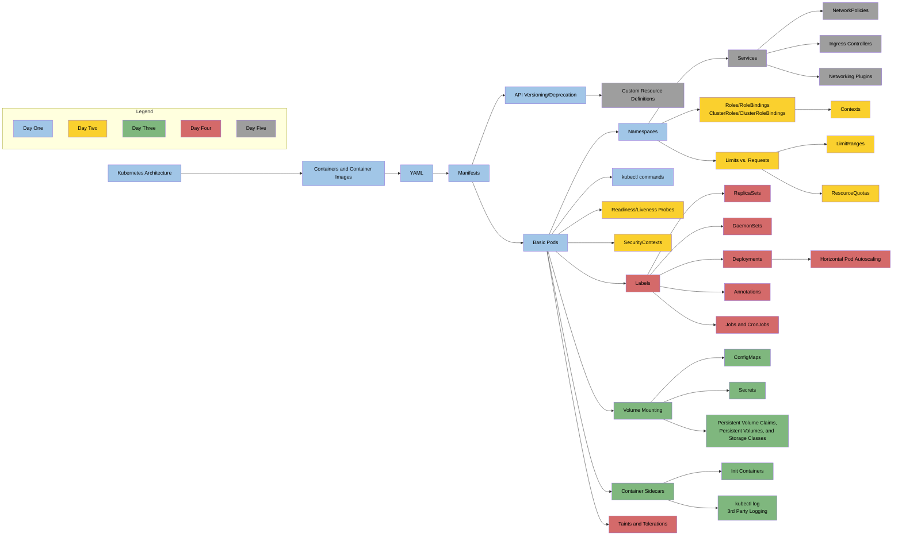

[Mermaid Flow Diagram Link](https://www.mermaidflow.app/flowchart#N4IgZgNg9g7iBcoB2UAmBTAzgg2qGAlqgC4AWCAjACxUA0Ip6BA5qcQgBwAM9RCIATgoBmYVQEh6AByiYCxAlCQJQADwQAmDRQEA6CgHYjxkx3oBPSgKocAvvVQBDYo5UgAxhEeZMWXAF16TGJzCD94HHACCAh4AGIAMQBBABEuDQBREECQLwAjdAh+AB5MKUckAAJg0PQAXgAdDyhoACd4PK93AGsAbiaAPgBhJWJ0VWJMYoB6MoqByRBUAlb0dwUlfgAVACEQexAQqXR+VfWK5jCAOTQToJCwlQOZOQ2kJLzMFoBXMbd1eBaHT6EyggxmECWeA6Gy2ez4IhkTQUABs9EYLDYnB4ID48BASUWL3kimUiBAAKoXBxUIo2gArLowWC7A5nK5yZ5vL5sBEcjUwrzImBorE4kkKEMURkDNl6PlCiU5lUBfUmu4WlB2p1HD1+iABgBpb4FVpIdBjTCVJKtdykeRrYjfVYzZULBwrR2k7Z7A5HE74s4uJCXdA3DCLVVPaSyElKD5fCC-ANqBBUmmUBlM5mmOG0BEkciAgwCdFMVjseDcXiofh7GOvb3kgEojQQ2lZnO5tkuNxcnzhHD8h6DqIxeISqUyuW5RwFIr40rlFUjxrNNodLp9QYjJAuAjm1pWiqoSq7-eHyoASQAto5mFhXcv3UtPesmyBdvt6P7To6LtctyRiO0YgMSbwJj8fzNggrbtpmFCMl2xh2PCICEIWlA0GWmKVtWuK1viQxErGbz-Jw9JopCCFIch4IHE4vacl4A5CsOtRCmOYqTtKso5AqC4gEuFTVKu6qatqW76gMACaSQALIADJPvMizLEGH5fn65jHH+5whoBEb3LUoHgaSkFJtBqZVpRFg0dmyGofm6GIkW1B0Aw5ZYlWOJ4iAKQkY2mwwdCXAcB5HaIQ5Xasks7J9ixPIBMZgq4FxE6SrxM4CUqy6ibUa4ahuOp6oM8kVAQYBYJMKlIC+6lesFn6+j+OkBiAQYAWGQEpSmzykeZnxQSmFKUGFEX2XR9FoRhSKAsIpaebh2I1vwCSBXGZLWSI9KMsIu0HYdu1UbSHAorFjEcqA-ZJXyvWcSK47ipl078XOiqLsq+VhIVEmbrq24GkkAAKV6VAAaugR6kgezDTCk6BSGczikrV9VvmR+Jaa1umBv+BndUZIBRog-VBe8Q2WSNAI7XtR30ydlBnU5BZze5OEVitBH8FkDabeR0L7XT9OHYz8AotYuhaNLMvS8IDHxcx3KDuxqUROlz1Tnx8rvYJwkrgV4nFVJgw7N4BDuJUwNoFMszPmpGOaS1hxtXpwahuGdzEyBpN8xBlPJgLtO6ELIvHXZ4uS7L0caPLM2uVhHkYpzPmrfiADiG2Y9tKIosIIIxRHhjCCiCtMddiUq-daWPdxL3a7O865SJqq-cbAPSVcjg3lg5TuI+duqR6GlNdjLu4x1+Mez13smb7YEDfGAdWaN0K5-nhiF9R0IGCXeas25Rgc95+F+VeWdNjnecFzm8HwKIpc9ldHiV2x1fq7XGVa9luvNwbP1Gy1P9UqBpugmkdBASoGobx3iQKgW2boHYjzJM1b8492qdQJp7YCc9gBk02hZQOIVUTX03rfCOD994uUwvNKiycT6+UIiAAAUhfYKV8N6OSLlwCgXAy7PxulXWeathSiniMkNImQf5N0+nlVugDJId0GAAJXQI4ZY5ofDTEUgQAAbugTRVpgatCgAUBB9th6NRQWPX8eN9LTyJiTPBftBqJiIRwm+zI768N4VQ2abkURJy8nhRh-BDRsK2qvEhnCt5Qg0FwKg-CErKzfsI0cn9EipHSFkN6MihJfXkeuIBJVAYDAAMprGdPIcw55xg1UHnVJBVifRoNsZPexhkvZOPwf7NxK8abr08SyCO8TEnxxoYYHE9CQlpxAMDCJQdBlkK8UXHQHBdC502VszZ9IklK1YslNJD0xFxAMAkHYRgck6zyfrb6aoimKJAQMcGPwe6VHklAb4e5YZoyae+Uezs2mYIcV0n2ziF7k0If0ygSyuHbwoGsjZ2zkW7PGWzbCS0U6nyYQARQWcQgQ9IKBDNBN4xCj84rlxfikw5qpjlPTORcgwVzG4fXyXIsSDzgGlN3CKZg5UpDmKHq+ZBLTtIT2BZ0nBjx55mSXn06mVgiUktMKsyifiE7QgxdMrmfllH4u2oS4lyzhnwrbBdRWFcaV3SOTXE5jLLnSLZbcwpRVikmwNBU9wqx6mIMsf86xgLXZ2PdlK3qplF4UwVUHI1KqUJF3NRqiZ2rgm6qYeDA1UTYWxLTOdPZVqDk2rpXap6KQqAoiSBWp1esCmcrdY80pildZCsaf6zGqDxUYKnmGtJEbIXL0VWvUhcKoTlpZtQ9FQTlqp25viAAGpmmmsaTWkooYE-N1LC1DnfqI0t5bK2Elyc62thsuUlOkqoqQEALaOAqb6ixIrmlYyDRK7thNQW4J6a44aMblUrtVdvEuYznL+MTsfGZs6QAyUXUq41I6xp8Kfskrdqt0knLLRWqtR6a0ctPfW7l0kUiOHQDeJQd6W3o1Fc+1pwb2mhvfdKvqLj5U-oJX++DoU+Forcim6d2L+AAC0YPQmXRxuCG7BGpOLR-dD+6sPXOPbhgBZ6PUDARleqA5ge57go389tNjaOSoY+G2VkaoWDp0OxnN4s2xJrmrHCEOqZ1+SSISZjkSARAj0P++N29xNIf2bdbdtqZN7sw4ehTOGW51r+uewYAAJLUBAABeoxHCQOtqeJIvxZDuHSz8hplGn0dpxl2jpxne2mf7dGkKXm41GDvuJ7jYHMUMNmUkXmEL+Zsbg9Z6g8SJOv1pSOelYoBAZHG+N6tf87lt3dUoz1UNdEWwHn6x9AaxWlbdl1bBJnwVyqjaxw1VnyHwqoAN5r0J6SOdTc5phqRhN1Z8w1hNHALVUsk8NjiJaxsTb+9N2R0W8OxdU1cC0MAtTdGtte9wBBVsPoaht6jnbttYJnt09z5mBZPY43SN7dnD43b46E-ESR1ruex9obzuPzuIcpQIobRaRs-fiJN-72GZuupBwtgYV4QyrB8GeUYJiYhQ1022p2NHX3ld25V-bZmB2U+BM98ERdacE6ZlOrFJOCSZwp7Vqn9XVfwt2hoQb1rgvSd3b9tnAP2VA+U-huLBowfEAh60bosMrZJmYAecX639MvrK-R2XGOuu9KO6vHHfXTca53nQ27-GsbCeiUbu+HANAUsushoLqHRvxAdcyu3LqYvtyeeeRwB4oaVDKUQNYjgjy-IlwCqXwedvo7BV+ljVNFnDusxn0ul3qAJ+J7MgAqin0T1mDAojp9nwLQirca0LyynKgP-73Kd6pvn8ghd7kr4ef3iPA+t9RyCxjfaCGK562niOM+uMgc1aIek4GEACB12UyfJ2VnwvSIkgLBaueO6y+5yjqHO6+s2CiBGgwwMYuBAwQBixAEMry6AZ4XgBAN4mAtAxQeQrQAwsB0MCBe4yBSYPcWBlQJ4NexAWo94qBQwr8TeAekuKOIa7ejinemO1+x2vWp2tIf+cebYI+Kc7+syVwX+PBP+tI1g72DOFueeLOmSkiq+v8EBXOZepSyiLQWA0wmhYQOwB4GizAUwuBwwSYCBrQuh2h9B3w5hlh+hcCsMR+jsLeLBdGbBH6Mq8u1WkeS63+pqUhsIQ+BgGgr+8AIhkGAA8uIbftvBwAIGbgAZukASFtbgXqAUXuAfbhvnNg2tJGAgUOsJAtAMwDgXgcIK0KeMDA3iEJUIpFAMwL7iGIwcfswVtqwWjuwZ+pwTVtwTEVCHEWbkEYtE5kniAIpNESrt4gYPSHPpakkYvszqFmKBItksXieo7tzk8jojePIFaLopgLoJUKogAI7fDVROFUYlboJn49ph4HZY436TFFzTEP4HwtYjE67ySPaG5PHwocCojm4obAEZIrFSKZEl7A7qHSTbHyDKIXDw7CotEuFtFuEdEeFMbh7fo94G7K647-GD6P40LxJTKJ465JDET64eK-FQgogUDrLIoMmAnJFL4ZIYYHprFKab6bGlJbAH6TAUFwKVBbBaGtAoxKAXHFYGbS4h4d5dGYnd7uJZp968GwR0lIoMlbICHiChGjFJDnyUlKkxIqnQjMxMkLHfZLGs5-ZTbgnrFclQk7g2HUE3hHFYCfK2ioEIwihICbQSlI5XFApvqh4cHymHbYlUl4l5pD68ba6zIADqExHGscCR9OOe5pIiGsbJ8mrKUW2RUBzuAwSQSAKALgbwfpJ+rhRmwZcp9xXBUSU+xpyZcehgWubWkGSQ9YoZv6Eh-haYAgWecxn2TOFpqRcQWZEWOZnOpe82TyzCpix4gpQwJiSAc5nwzRzhgap+7R5+e2XeYZipvhPZq6284gBJbxa8JJo+kG8W3xuJfW50-+qZC+Umixo5oJyhNydpOR0BBoqiXwzo-cOK3wUALg5ZrR1x25txIZtZPRUePxuOD5ceVIROKc9+syik6AD4cCj21IRcYgBg0Ut8G6a+YxmFBitYzem59AKAGAnEikFAiwikGgjFwgjFVAjF9I2QrhmAJozAopUg5Ae2E6RYyFoR9+e5Dx1kxJeFVABFU046oGWqrZEGfk9FRIDeiB2C+IGFWFFFXZxCuF8K8RZpL5I5GsPEr0kWU5kJM5pSRG5glQER5o65lxUpbeaJF+VWV+sFAIwghltI9IC0hFXizZMZbZqlzF0gGle4WlpFulKe-lCAwgGgj58+gB6ZaGT075HJDu9ptlhGjgDlWwEOLlkpQeNxFWdxCuPlSViVa8BgxK8loVylaa-AikrFUVqwMVQE2lZF2FBpNMdVs+JlX2GZGSK+OVeZKmPO9lQppAqw6ApV-pblFV1ZnhEldZvldV1AXAcldEClmq7MrWKlTCik7FnVmlPVcV5FCVGY8AVA6qiRQ5lur5mZcmE5JFEJGxDpBos1CQ7pS1FZKJVZsp613RPhtVd1dJXA+cTV0ZLVd2bVnFF13VEYvV8VA1CGEc12MhaZplY1JybONpVlqh05uRgwf1eii1hWem4FgZMuoNGJMFEN9821Ag+0wVLIcIOQ6AqAD4QooAbS7gTpUAN4iwd4HuUMZSLgrQlYIAUAxwyg9AEt3QUMGQ2F+IMgB47AvAe4UMuobwcZmq8SQlwQJiqtRtEyBwfkvND4AAtAihwAYDYBnnSZRJGO6f3PwG5ocA3g+HLZ2TLf7fFieDKiAAxUEJ7egCHXAmHRHU+aACRYsGECGGzFQkLSLWLcrQ3qra0NLdUfwArQYuLTnWrRrQvNrYsNrfrQGpbfZjiE4t7ObegHXW5NbUwrbegA7XSWdFQDoDoDwh7QBe1IHX7RaPwBSb7a0MHaHe1PHf+R6THagHHWpHMUnfKAYswGnWhBncEKLSXZLXnTLXLUXUrSACrWXUwlrXuFXXraKbXcbQ3WCk3VABbYde3fwJ3XbcIDCCXLnGFPSOdcTFHRPYsEHePfiAFD+GPcQEvSvZHcPXA3PavVSuvbkJvdvc5Lvc6QfbnfnbLYXYrbg5ffwNfTrbiHfQbaSK3ZoE-bgi-W-VbbMl-T-VwCiEShLOw+FEPR6fwFA1Pf7WtGAzA0g-wPPVHaI-iPHWlZOfiMnRg23TvbRsLXvVnefaXUfQXfiKfcQ60OrVfVAJXbrWMPfYbY-abcQM3TQ9CB-fiF-dwK2NYFSJnukDw17fiJ1uA3LXrgIxaJI+HW49HbPWIyg8-GgynVvYo1g8o5nbo-gyfUQ9nYffo6Q4YzfcYzXWY0SXQ54Qwy3e-cw3zV3RnlSAIOCBwH5Q1YEzzMI9PRAyAPqb47A8E1I4E-49I2vSoSAPI6nVE4LTE6o3E8fYQ8XUk7nSk5rWk+Q9XaY9Q+Y3Lnk9YxQLYyAF-c7WdKiIFQ9U7dUx47U4I-iKwtA3U807Hcgwg4vS0wE4keEwo5QOnQMzg2M1LcM9o4k+o8k+XWQ7fSY1Q0oNYybQs2ba-fk0w5Bl-YSq7fSLvDPsILKBc+4yAJ4zA2Evs341c+I4gxi6E24Lc70-c0oxPCo08x83g68-Le8xfXo181Mz85k3M9kxY1YwU+C0U3bUIESpnrwmw2ILs3Mmi3LXisczPWcyEwi0E6K60zc10z05EwS9E0S7E885owQ286M6SyQ5M0YxQ78w-Yy0C5YyC0sys1-SlS8XSVQD-XnHy-MsK-U-qna6c8vec8A1i5K9cwnbI90xvfizY4S+1MS-vcq-EyM2fVSxMxXekzq-S-8-M43cC4w2nYU-bRLJZlwJy+dkAwvYi8iyc-wBmo6+0209i9K3krK5g-04q4M8G+Szo8qxG98xk7M7G-q-G4a4m23cm13dYLwoEjwiWAtHywW00-wAuoWyW665c+6x06gzKz63K36wqwG0qxqyqwk+q+GzS9qzM380gACzkyNAm6C0m6y-bezTDa2OvGw8jZO4i8O14-wNBuO9O8Wy+6W2yuW30xBR4Cu1SyG2q2Gxow27S027u-u0y0ayyzbWy9MbSeCOmwikIEOwK4JgK0W+K+h563iwu8s-6-wIG2o3+7W5S0B1u1Gzu3q-XRBx2-c123bedC4xoDPhoGUxIOK6h4697T7V45h9mxK862K1h3O+g767h0u-h7+xo-+xSxu6RwY9u5Q5R0WIC228y2C9B-bQYGFOdOCA1bwpFbe+1D4w+6TrmyKwJ1K4Z5hzI9hxW9+wR0M1ozJ4B58-J+R4p1k1Rwa2pyexp13eWvSP2Ww-EhwO7ex6Zyh6TvwzxxO3x9Z502W-O3Z9g0G6u9J3W6u8Bwp7q558pwe24Ee8a3Rz-UINLIYClWx4Z97WZ-U2Tmh7FxIxOzZ8JxE8l486l0R05xl5u259Mx5wy156p5B+px3WywIGU9wDPjYEx1wHyx1pF7rvV2+1Z01wlx+0l1+yl4R1J8R7J656k9lzG3u3G8-YV1B6N-bQyLJchTDVoHyzV3Lba007x418t814lyJzhw81WyS516q857o1l+5zlwN3l9R8e526e92yXLtbtAIGdD-fdwt1sEtxZx63F6t7Ox9615t+19t4felyR-t1q8D0d+B958N75xd13ZRLtToCx7PvtHyyj5x-iBPs+2j5i1O5zzi+SLZ7jz9x1zt110T+M2R31yDy24N6d+2xD7R1D+y0YD-TQNwNSFmyA-iE9yZyAJ-hz-Ayt292t4JJ+-K5W8u9W2l7ty52L713S828d62zLz55D353bVoAtA9SlXnDDXy8Zyi-iGIXry6xj4b1j+t59214L-j2SyL3tzbwd6T-b+T0NzRzY3R4F35dC3p+CCiMzwt1EUH4JyHzz++8bxt6b-Z5JwT1b4D+L3b2Byd-Q2dyN5-TB7JRLNdjy7HHy+MazyAF8YX5Z8X-r+9+HzjxX1t45-9913JwnxL2T437k831T63-beWqIIhECHSDe3x-wH73m9paj-r8Py66P2XxHwL+b798L9P6L5q5G-P0n4v4e7L0Vwr7HFpwkpa8leN0j33+SUf2D6vcS+QnbHnc0XZm8JOFvP7uu2t739G20bJ-o7yb6v9zuq-LuvtEMAIpkqJYGYny3JwjtScjTGLstxP6Ccz+-AE3hAMr7QCb+sA2vrb1A5KdaG4PN-q70C5sNnaOgQJCiHhZVd8Q97f3iAATKD90ewAkfkb0oHl9qBk-GtrHzgHUtGBiAhvsgKX6oCW+djMbhLHEA-0xAZTLnnewW4dlABRfcQaf0kFyNpBYnSAfiAc5yDb+cfeASB2UHMDAQ+XckMvxd7U87aDVfsnEUCSUQ8B4XEAIH0IGCARAegkwUPzMHkCLB3rC-hPzx5T96B9bOvkwNy4sCKeqfZZnR25YPUaA43MQLN2CHRchBD3F7m6xAEUDLBCQmQUkPsEpDMuaQlwRkLcGsC0Bmg+2oFxoC5xAqWnZKj3wW43lRBBg-jhILD7n9x+frHIMtnQAwAZAqrayDMRRBSxzsEsdIOzWEBxF+yEcejlwF0BvYGs2ArYcrwhCpZ968AfYQtHOgzFtAGeeJJexoB5hXw94UUjeHkgWhHARGKlGAGXLEByoxAExm4AUDEAw6aCJEigkUgOsmC+iVJNAm0yTBDkz1fwNbUwAZBVACw4gFUXNAQAIiRDeAJYzOL0BLgpidLBkCKZbBg0oAVAN8HSwIAwA6WXwPKCryUiJ4ZAC2N0EWCd1yoh9VkQGxMQ+BFg9afgHEDyAUAxReQXPgcBJF5B0snsPkcCMMxBkZ4wo-EHEGpAajihIAWUT0D4qfI4EIwNoCKLAAmjTRiwPIFqAwCtBDRWoEUZqOpDmjLRUMLYPaB6CGJ+AiYPgLwEwBEZMAjAQiAyIgC+A4QQAA)
