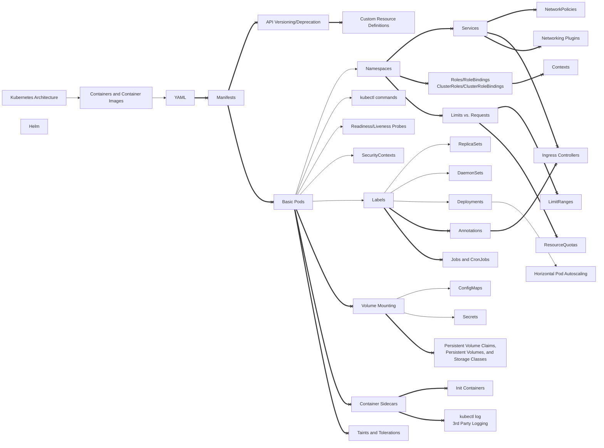

[Mermaid Flow Diagram Link](https://www.mermaidflow.app/flowchart#N4IgZgNg9g7iBcoB2UAmBTAzgg2qGAlqgC4AWCAjACxUA0Ip6BA5qcQgBwAM9RCIATgoBmYVQEh6AByiYCxAlCQJQADwQAmDRQEA6CgHYjxkx3oBPSgKocAvvVQBDYo5UgAxhEeZMWXAF16TGJzCD94HHACCAh4AGIAMQBBABEuDQBREECQLwAjdAh+AB5MKUckAAJg0PQAXgAdDyhoACd4PK93AGsAbiaAPgBhJWJ0VWJMYoB6MoqByRBUAlb0dwUlfgAVACFF1oruzBSDmGVEexBy1aRiACVDhB4l04BlELCEMEcIX0uQqTofirdYVZhhAByaCB0lk8kUSCSeUwLQArmM3Op4FodPoTPiDGYQJZ4DobLZ7PgiGRNBQAGz0RgsNicZ58eAgJKLGRyDbnNQIKhcZ4kijaACsugJBLsDmcrkQHi8PnCOByNTC2AiURi8SSFCGdIyBmy9HyhRKcyqGvqTXcLSg7U6jh6-RAAwA0qiCq0kOgxphKklWu5SPI1sRUasZlaFg4VhGEds9vQDkgjidHGcVJdruhbg9008HG8PkD4N9fuh-uZAcCI2DIdDuXC+UiURB0eWBfAhSLKBKpdLTBTaFSSORsQYBIymKx2PBuLxUPwU1dW0nFVi6RoiaLB8OR3KXG5PN5fFq1UEy5edbE4vrDcbTblHAUihzSuVrWXGs02h0XR9IMIy3I4BB+q0gYVKglSgS4EHoK0lQAJIALaOMwWAxt+cZLAm6ybiAuz7IcxynPyuaODc9yPPAzyoKWtRfD8fz0AC5YgCCLhIOC6BQhgLa8gi7ZohiW4IDue4DhQkqHsYdiUiAhATpQNCzsyC5LiA7IgEMQnwpsEmLuKDLEjJcnyYSlxOCeipniql7qjeuB3nqBpGiaOTmh+IBfhU1S-naDpOkBboDAAmkkACyAAyOHzIsyzcURJGpmRmbZhc0jUfmtFFvRJZZu8zEVqx1bsbWnHcY2-HNrCwlKKJnbiT2HCmRYFlDvJiljsp1KTtQdAMHOLKLmyK4cikBl8pilBcBww37rJ3WHrKSzyqeyoXgE161LeYDRPej6eS+PmWt+gW1H+9oAc6rqDNFFQEGAWCTAlSB4cliZGcRa5phmFE5jlNGFt0xYvMVZYsVWNZ1hyNW8U2gkNYZiLImJ3YgFiFALUtXVWdZSkqTS2LCDOI2aayy78AkM2bj2IjipKwjM2z7PM2ZoocHS622QqoAOTtETOftrmHbqD4ec+3lvhan5WldYQ3SFgEusB7pJAACihlQAGpIXISgQcw0wpOgUggs4CIfV9BGzRyaVcRlQPZVcuUFnRDFMZ8ZWw5V8NcQ2SN1Sj66NejHZdnNpKsyzHMJ1zlA87146k0NGnztTOmTSAWSow7jNx7occJ2zSfwHS1i6Fotd17Xwg2Zt9nbaqouauLR3uU+XlmnLvn+T+13BXdYWDDs3gEO4lRa2gUyzLhSX26l-0u1mlEg3lYMQ4xUOlZWbEgBx9agiHAkwuHaPNdHxlM-HZfl51lfV-Xr8aI3xMDWpw1Mln400xyAA4vTIyjM6R0mEHiNaT9DDCDpE3OygtW5OT2h3bUEtjrS17q+d8F0Ao2hVqPdW4UISODQlgco7hsIL0SvGFKv0nYA3IuvYG7tQZeyKjAEqvsD4VSPlVE+PE+LnxAZHTGMd6QQKgcOaSpIDBwNHGnQaRhM5jW0rpFCoiJHgMgYYaB5l4CiHgceAWSpzxt1QaqNyUse5nX7ngoeysR6OjVg9d03RvQRggJUe0aEMJIFQPPWMS96HnD+qRdMzCsrACouwgq3s948PKnDaqwdhH1Uvm2DGLUsY4x0dI6UsijGKP6qpMmZlf5qImvwAAUlo2++S9EyJgVwXGCDTFCwsSAG0B0u6JFSOkLIstcEK0ugQ5xoViGDDuOgRwyw-Q+GmLFAgAA3fMWBAxa1aFAAoQTF50J+mExha9omxK3hwyGXDoZ+0PsfBGaTkYXx5FfbJN8wFSKaYUlpbTP5lPpD-UaWlqkcg9PU95uiepPw0FwKg7StrmJQd0ly6C+nJDSJkOxIy-KK3Gf+Fx90NYDFeGsKM8hzDwXGO9Ghn0QmHOTBEwGLC3Z5k9vEzh3Dyy8JSYI2qIiC4iVea1bGlBGmQoMdC2Fvz04GGeJUoFACQBazBcK0kor9Gih0BwXQ4CdW6p1eKOFLcEW7SRWLFFksDAJB2EYIZfcsWDyVraPFky3EDD1michlRopQFRLcE2ttaWEQYavSJmUN5sPOWyy5HKYa3IEfc0+6Sw7PKyVHIVeSPlio1QILVeq810gNVKwa6lKZ-3UbnAAisqnGAhxQUAKTKGBsljEbUQWYxyJqemdwtVam1mL5bYrGUFZ1rjCWgUOswJ6Ug9m0PwqE+l6VQ2uxiZvVl4NCrRuuVygOqTE2PNEdfdNVg60NvxLIigzaSkk2LQCqm-8c78DuNW499bPmNoMWKDgfNm5IONSLSxvSe3WoMLanBA6HW4tuvise7piXuFWFS4JByg1HJDYy05q78rroSVc-eySd08rPhklNAq025Jfae0wMDdyp1KenEtcrs66T1s+1Vmb1WCl5oa39Hb-2mrQZEDB8QUhUDpEkMT-aB44uHVBl1hLYr9xnTS5DDtwmLvQ+GllWGd4+05fh-hgdEZJqeRuJqgryNsYhRx3sXGi3f1UfKh9HIAAarGdAnrfWep+cDYUmPhbxq8-GrFCbiCJsTEnhngek8PEdBLwozKkBAKejhiWIf2XOuljs0NRM0x7bTG7d64aSf7Azu6hH7v5WZsjEja2vqzQgHzV6v6kgY4CpjucIpudq5RhSLSuDcfbcLQLXbzX3jC+JrkkWpNDpi7J0d4UUiOHQGhJQqWlN23nVlhlOXWFae3gV3Tsa+F3KDnu0OJmI6Hos+5ur1ncb9bsy129ZbgUgAAFpdY8-Vyuu4BudMRSNwTfTxsRbtVFmbTjYswYGObRLUBzDkNuOtwNqnjlLqZSuiNa6dOJL0yVk7RmKuZNI+I2+3XPNUYMVJJrZT35EkY-e3SSQuSVf5CqnEegKe9ap79vzRqAvt2C8D0TE3JMOMdYQ6DUz3QAAlHQEAAF6jB+DPNAQZ0SyHcD8f11KNuZbU87dHGGsf5ZwzGm5x342nfK+dg95mY4c560YWR1PHsZ1LVUhVSR87E9ASqm7TvCQwKoNCv7yDO3IqB5LAQGQY8x7F6M-BMnVZxcGMS1oKyp7UKQxllDC7Dcad23l-bZut36YJw823rOrs1a+3dkPD2+rXsoOKenbXGe51SKxx3XPnfUa-WHv9w3I-WLj7H0D51E+OKdXN1P7oIT+hgI6bos8kvuAINn9L3089bfUzt5lxeLmFfN9u0rhHjN2+q8ZHv33P20eb3Itvd7y38CSHTVnDvtCc9vw3wfAuAPdr3hj7x5Tbi6QYp7Q4oS8SrA+BwSjDbIxCGwBoqYrzbZhpF5xLYbspl745W6E5V6+5iI5Kf64i95B4fq-5u6LQObtav7AIf7X5f6B7nrMwaB-5DaC6AZAHj4gFg7TZJ6zYQHS4DAL7EBL6tDdAmwzydjMAQTI4oHBpoHLpnLY4Ha45HbcoJo258qEE16MGkG36sE07SoVLt4v6OxuZqrNIGIcAaAtr8z+YcEAGjbxCWrAYT72JT4S4TLzYgTK6ITISvBEBrDUTyG56o7ZboEH6YE45FZ45xqGaV46EkZVak7grMFPy2HwJu6iY0Ed78AACqn2t21hJIBgdI-WfOPGThQWXBrhvaIGCeg6AhkOs+kBSA8gcBYEARYR2+ERShGOKhpu2BeGuBiRZ2yRpmRBby-u5O325RjeSiDWrMeRAgr2rwxRGRH66QvmraHS4efGgO1ibhfaoBXh4BRCrqWshsBAwQeU+sHq6AcEXgBAaEmAtAxQeQrQAw1xUEtxYwtwDxnY5C7xlQMElQ7wjomETxQwyCyB4RqBe+URmOe2R+h2Fumh1uvKxGUxehjMcxd2Oxxhk4u4phd6axCqEImxZB561g36ba-2EeZqUe94aKgyTREGyelxhKdwLQWA0wvJYQOwEE8yzAUwXxwwnYdxrQgp-JsJqI0pspwpASJsvRy8ihSJyhmGJeIxxWCRZW2JyauJ9uZOdepRVg5IbuBgGgqxr2AA8tSd9hwAIGwVUYNl0kcSFicY0Wcc0dPpLnJuFB4gUOsN4tAMwJ8d8cIK0LBFrNRCEJULFFAMwLIbxPCX0YiQXvviiYflGsfjgfqefkTikdMUeqSASeaYuC6cSZQNOHkeYSALFI6XdgYOKJUXsY4R6SPiFmyRir6ZyYIdyeFMsmhPIIGCspgLoJUDMgAI6ohvRqmbYG5MLIlDE6mbqjGFlaGGkXYvJX74lmlfIfqtmLF0Y3r1mvbRTd5ME0kwIcD0jsFdnMnWK9keH2rRatFCGuojnyCFhYSLn65o6F7RGRpYEbl6mW7jHaE4mXYmk9g353b3nZFN7NbQqypmGvZJD6QMHpG3lU4UC5r5p6qPkA7dnC7haTZ8FgFclS6upbDgRI5gkBKVBbB8kHB8gAU77LknK5YxFqFxEaEEbblEZGmwX7n+5WFHkkh0gEXapEW6o1nYjiAXle6aI4USXsaVkEVcZumMmHFkXR48Fvng4tEz5fljoKnEBQBoTTlYA+ohhPHmyHQdEcXpnqmoYDHG6ol5nomn4V4TEwV7lpEaVWZaUpyKXu4M4NkADqzZlZ78rpHZ-ONRnp5Fou-ZH5ZlQ5gwSQSAKALgrluuKOmZK5WpJu65+Zm5kFBpIlu5qawVNah576JICVEVBgz2nuTmnIa4JZteJRUlgoAg9hP67ppFz5IWIOlFYG-B-pPhc+AwNSOy0EzFQw2ySAi1yIblS5QF2Za5aJ6hGJQlWJtVl+DVFGeFJI4gyFSxqq6Fz+r2Mu15Bhd2vMuxDhyVT5AmL5AyfZVF5xNFgZ0ydlUYVCFaqIUALgnF-Rmpgx2p+1Alh1Z+wlF+1ecF7ON5t+r1ilQoT+f8CxCqsU6AWEAS3ewoMCYgBgq0MiA2k+jZRN+YK4ChHl9AKAGAt4sUFAiwsUGgXNwgXNVAXN4oL4pVsNBelAcNPlB1xArQ85mJmA3ozABwUg5AlibgD+ONeRCxuYxp4lWIaF5NVAlNhM9+zWkVGFBNnNmGIiHIhNxNjNhBEiZNH61ZulBxw+41fSJ0Msf1fp3hUOwhi25glQdpfoW1gFkRZV3l66FAup8R1VRZBBJZeJKqwgTtoo4o5MVNhSEVrW91BNPNVtzYNt9NJN6lOMadDWGgb1I1el7tX1PZP1xlM1ftbRAdjgQdWwS+YdXFO1q5Et0dsdglSNx1KNuhaNWIqd-YqqBg9axtOdHVjmuksUfNhdgkxddtbmFdlc7Z711Rn1QuQGpxPtA5n52V7ogdLFpAqw6A3d0NWZfd5VdEMd4FcdmJ+BkxYlZ1hiW91AXARtVkJtfyudL2BNAtq9nEttDNm9U9VApkJFTJ9daVoO011Fg5tFhKF9CQ9lt9JVPFGBoF4tL9Q9-l0FolQVxBxkk9d5XAkCc9ORC9tBNtQt4D-AkDpdDtt8W9re9J+xQ+nBgB8QwBTdqDp96DC27dlQCQqyN9RVTN+eItXluZA9RDiNJDO5p1FDPYVDztrMWdMoFIOQ6AqA-5uAoAJ27gll1liwGEEhSE7w8Z-AUAgIyg9ANj3QSEGQJNHITj+YiwEEYwBwKG0VqFzwNobgwQ2y7jwTfylwukRjWEAAtOKBoEIHAlwK3hoPIosCiCDZxCzkfNRFhAuCAGuC4K0EUzLjBL7CAJbd0vZVQpUwEtU7U7vSgxyIsGELxOnJcM9BhGMJNNLbLX1OY5Y2hNY9RO460PY60MUz4y4yAG4x414+uP4347cEhC6HyNE6TNCqrYqBE1AFE6bbE7nPE+gAk6nTJRwHAgRTQ7Uzkw5auIsGU0U-wNhQU+U-6I06gM09k-U+gN87826bTR0-mMwN00pCM8EFY64xM3Y2U7M84+M7Y60J47nPBrINgLwOs4E1syE3s6AAc0c7Tic-wGcxc3WrjKZDzIbSaEEP828884U-6PwNNOxMy8QIC5xPc-81y-wC0yNSC2aGCxC8M1bhY9C2M7Cyi9M4i749K5M2i-wBiz4GswE5swiNsySaE9coS9LYc+gFq5oKSxyOS3AmzO1a0sk2A3U7k6y0y588U+-h8xU1U9y387k3yxyAK22kK7kCK4NCUlC1ZVKws3C1Mwi440iwq0s7nDIKs9i+q0E-i0FuE-q8S90wquS9c7WqIO1UYLuB648xyD7i8yy0Ag66600+6-S5626-y0lIK54SAKC104G5C+K6M8i5M7K1G-K2Gyi0qxyPG7cGqxs8m7Tjq6VHq5E4a8c1m8Y+c3SFQKIOkK3gIGscw7a8W3nJW+WyAGpS618-W960Ww0yezU42768262+C+22K4HBKyG92-Cw4949GwO4q8syO+wIm+O3i5OwS0irO0a6SCayAOS4bdYCIMKOAjmme5xKWxy7Unu5yxezy3W9Ww28Cze8K225QEG525Ky+xG2+yAHMyR0Oys6O3+7i5qym2E-s+m3OzEwu4kxuzJQWuKLWtx3SAh-wEh46-wKCuy46165e7Ww5eJz66Yn6503ewRx24+12zG6RzM32-M4s6i9+1AAmzpDixq0oKB7s6m0xyB-O11Wa7-azNoDoBevxxyEqqJ68xyFWs58e1h6e5J+e55xJ0laAHJwG4pw+5xE+zC5+6++p++-21p1Rz+2O3R0Zwx7q8Bwa6BxQOB+S-SFwAIMIK2aZGKBhzu050e8U0+u52h750Vz5z8zW-520y23hwp2B0p6FypxF2p3K5p+G3F7pzR-p0mwBzs1O77DO2lxZ3E4uwk-SDmjYOkxerlw57uxV-wCxhV9Jwhxtzh1ire6K2Y0R8+6p729F914Ozp3p-4-+-R4B6Z2Nxm4G2x+c1QBejoC6bzO1QXdu1Qqt6h-wK5ut+h5t4D9twOrt-e-t8p8R0d5Gyd5R+d-15d4l0gMZyN1jESyx5m5Z1N86RAq2YtCnFwEt2t6V-wJ1gD1V0DxTyD75GD8FxD211Dx18d+Rx+7F-D7+wN1d0lzd4x3dxjw91j4k9wNa7AyHgIDPUT79xyB9uT7V9h19wC8D-V4F-hy1yF8q+11p8zxR6p71xdwZxO8N0B+j+l5l1N9B1XDl+URndV5xDLyTxyMzqh1twry760yr81xl61xr4z1rzDyzzFz18syq1i5z0jyj8b8x8Z2b4ky91oMu9Cs6RIN55xPQQ75yIJ1W3L15670r+77h-66r17+rxyGF6G372Rzrx11RyHwl4Z8j8l9O6l-d8a49wk5k-N2KLuDQBwEt97lL5yGy6Vy7w8zV0C8rwX-J3t8PWXyR9r6z0H+i9sqq7R-XxH7d83-z634L+c+KK2S6ck6nbl3xyn6-pn-u2-s70r6P4r1TxPzt019P8G+FxX1FwH6d1+0v5i3X4b9q5H+ZySzb64xl2hIVdtaUJ6n9He5-YpkkDT5ltKu2fPzjfzd5NsH+hfT3oR0h6Hcme-vKvmzy-4r8w+a-RvqN037R8gBRiArkNV3B0sFeAnAfiV3gEj9eWefVAaD0f7g8Z+mvcNvP0D5ncCBofRHsQJ54pcTeqFGPucxSZigE+dIGVDCiW7QDtgV-O-sgNYHXs0BU-Tgc-3L48DcBC-fgcq2X6CCDeQ3P-hvzEGACd+03cBG2XECT0JekA4iAPyKKy9x+qgu-vnw0FBc1e9PH3tgNf5dc4eAgn-qYM0Co802AAnZhIISZVxWYYgUTK2VxhLdGByHDkBsVcF1d3BiAmTm4A95P8DuL-XQZX30Gf9DB3-Vfr-zCH-9xulgybrH2nCZNuAqdZJsnzoEVsVuHIKkhkPl5ZDx+ng9gegPyFYDChMrPQXwNKGl8jBIQ67kb3MFR9xBbfJPnl1iEcBWyNrG-koI6EgAHS3QnPr0Lq79CaeHAunlwN95FC3+eAxfmUMIFCDKh2IcIWZxqFRC2+htLQIbWECND2qS3JslsKvK7CkBLAjwWwKOGDCtBBQnQaMOKHjDY21w4wYNxmFmDeeZAhYVYPFA0BDAMKKuh8NoEbD2h6fH4cP2v6AjshV7WTpP28HF9fBpfbgZCIuElCYRkw8oUQLuEmckRFg54aiPvLCAeYZIRaCvTaHLd0+WFZQSSJT4oD1BAwzQScO0Fz8xhH-BkR4CmEVDQh9w6oS32xDRCEq1rd+Mu3g6ODnW8A1-IeyYFEjMOoo+-pKIpGYCGe-g84YEN17B8lRzIlUayNEHzDahpzKbl-gIoZ1TImTLdriJADE9DRHIWKv8Nt7iiyRXgovtaL8EjCe2cooIbCOmHc9ZhbI90RyLqFPcCKz3UQLYVTo4iGWHIYMakO6oii3BxIvocCP4C08fBpw20bSPtHV9HRTI24S6IeF89yBVg9+GiLQqrDcY6wosSAC6Hp9UmYgVoSaJUGViDh1Y9pscLrEyjoeUI+Udp2CHKiERVQuYZEJJLRDasuMd+DoC0AQCBRQ-EMYKMnHmj9h8vQ4TWPnGUj6x8YyLk2PwHJj1xqYxEW6O3Hb8sxCTGVK3mtJci7CJ-AUQSLPGPVwxlPc0TeLnGgjFOOQTPOgBgAyAouPYNsnSBrgh5LeKTPMRxyfgxCuAugL9M7gvR5jhA1AIkErisb0QS4Q1dqOkAIpHidwy7SVPGEwgHA0I0Uf0I4EWxtowAa1YgE9GIABM3ACgYgNUxAA2R3KrDcrgiTWSIpfEiOSYCalrr+BYmmADIKoGQnEA4yfoCAHaSRYW56A4IHZD8AyCLstg8aUAKgFRA-AjsZoRCBZMDhkAp44MegGcyegotHJoXJ0bJn4BxA8gFAAKXkD46XBjJeQH4OfC8kiS8CSRDJL5I5BxBhQSU48eFJ6CK0fUASEYG0D8lgBcpeUxYHkEdAYBWgWUx0H5OSnCgCpRUpCFsDDA9AFkWoOpklntq3FFsmARgJNC5S2AgAA
)
