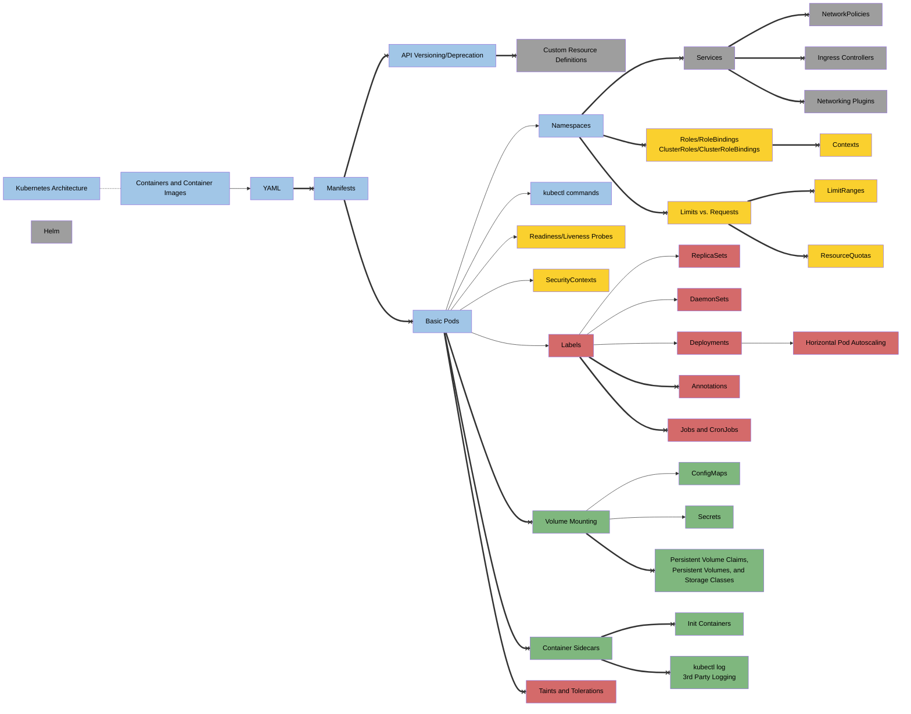

[Mermaid Flow Diagram Link](kE8AI3QIfgBhJWJ0VWJsewIAJ3Q3BSV+ABUAIUkQaockAGtMZM6YZUQ7ECkHWqRiACUu7oQeEFQBgGVg0IQwBwgfEeCpdH5a+q7mUIA5NAPAtYPhwPy60tQNrZ9pWXlFJESczCgIACupVc6ngWh0+mMUNMIAs8AoVls9k6zGYBCQzBe23QdnwRDImgoADZ6IwWGxOAs+PAQIl2jI5A0hmpNFwFnCKBoKABWXQAdgFgqFAqRiycLkQ7k83jCOCyQRCssi0TiiQohSJaT5mXouXy-AA0gC8tUkOhSpgAASJapuUjyR4A2rtVA1R5fZpteidHp9AbMkZjCbTWbzZEOGCrRVYnb0Pa3DqPE7nS7tBXrO4gHyheroZ7wTbY96Mr4-P6A4GS0FadmULm84WNvm2XEgQgkchgvkCUlMVjseDcXj5kBe0YfJkghBUDQccx1nn8ptC0WOZyuDxeHzYcLym47iJgKIxWJqjVanXZBx5Ao04qTBzo9DVK1dVCW+-OJ-VS0ASQAtg4zC+FURyTjSrTtD6vT9BGAbSOM6CTDMPRhosKw3DGOJxmY+yHEmGIphgaaYZm2aPHmWHFp8Shlv8QK3Cy8AznOsILg2y6CquKJohiWGtu2BLwjQvbkgOQ4gNSICFPSE4elWCBEtyJJsfC9ZLpxzYjGuEqgJuMoHnuioHsqJ5npq2pZHqt4gAAmokACyAAyLpuvU8kgJB3qzH6cEqIGiHIaG8ALEsEZRhmhaxiA8b4cchHoBcxHXNGZEPLm+ZReg1FMnRFaMSAoJKSpHLqZpIo2AJ+KdtQdAMH2FKDlSI7JLJJaNApg4cHVpWLuVWn2OKG7Stu-gpaEJlHiqp7qhZl7WfwDldAQYBYBUrlgR5XkdD5sGDP5CHBihcwheGkakVluy4QmYHJolqbjYxIzkRlVHju13y-PRlZMRw3XzmpfXlS2tB4h2lAifVYmUsO-AZDl8lMRQPJEvy3LoxjmPowDRLdboRIE4TROE9pQ2Svpo27o9k3Hqqs0XlZ176jSLReAQbiWgACmglSLG54GeWO0G+ftmZBkhIaoad6HhRdrzYTF11xc4CVJVcWakcAz3pU8b0MjRn3lgxU7wijaNYxbON48TNsE5VoNttVmjCD2UP9jDkkjvEbUGybyPKebFuYwDFB-RopPruTI2ykZE24KZdPnpZupMzZiSc7+loAGrPnISjoswAD0yToFIRxOB6oHuh1gtQbt-oHaMgWSydoUYall04XhNK3arD0a6lWv3DmusFvLCO0V9+V+2bfJB1jIdh-bYNCbVonu01sM0gA4j74FI1QBOQlCRgwhyc9cBHulSluMfU-HU1mfTydXje-BnA4-5YGMbggXzm0122sLPa8Em5HWCm3WWHd5ZXW7omeKpx7rJQHhmIeWYdaUTHkWd6Bs8rG06tQI+BgT6GDPpQC+y9Hbg3hESBYZIN4SSkgACT3ojQqrIITEJIcIMhNDupX2GrfQy99wgJwSCkdI81U78CmFgKATpf4AEUARQGcLzV0AChi128r6EBjdxZBSlpA860DsSwJugRRBasSKD21iPTBWUJ6G2+gVas2g9BcJIbw4k-DwyogLvxB2gkaoCnXo1RhI5fysI6gfIh3CTAAw0N2XQ8TDB8gEVHIRY0UFKkfonOajM340m6MaR4EBLRuCgP+QCSBUDqP5ltIW9c-Ji2bsdNCYUTGRRgV3CxCCiLq3TE9YeFFMrjxwblKe+DYmo08SfXhSSBApNScIdJVVqEaGECpeh4Tmr8AAFLROZOw4ScT4neK4BQS+g1I56WjsInJNNppJFSBoDIhTmYgFkQ4V0ZpvCFycgQAAbkhLAVpObVCgHkepmjPR110Q3Vp4CjFnQircTuis4G9ysf3IZjcXqj0cRM0sUyfonMIbM1JFyrmUOCZQIkdUdniT2TSA0Ry-aH0peckOVA+TLNSekm518KZ30eQ-Wm4jXnvJTkUkAyw6hOnkGYT8ZR1pV3coAppCKWloIMS3Dp7dulmN6crO61jHr4owWM7B+tJlGzJaCClx9uHeN5fy+JayglO3hN2MJzKt4gBck4v2c8qDOq8SHChQrBEGWyUMp5J4XmSI+TZQF-55BWiBZgXQlpZEAEcARrRhdXLRQDmmi11W0iBqK5bGsxX0lWOLkF4rSvY61bxiWT3ta48h3Iw1zOhJG7kl91mr0hkyj2UkHLss6uCDxVLF7EgyXcrJVMxWiLyZK5NMrPlpvkChYCxaNWlq1TBRFlbkWtxraY6KsUe6WIGTY1BdjRl6zkl2lxJs53hvmYuoktLvWzm2Q1AcAgWUgDODOpGoaf2DtUgiawy6b6xrXfG8VzyJFvKkbKqY-wsCF1w6EFo6JfnMEwAAHhyNUAAfIUQEQRnyEfw3RgEDHqhMeI7UguR6BZlu1RWgKl6DVQKNbepW97+lIMGZrF9r0sEdttSS7tIa+2weMN4xEAHqEUD5DCCd8AwMBoAPJQfJTBgd6mAYcAEOHaNmSUNyhEYeCVfJ4gtAFNK1+nySl5HqOU6AzBKM0eENUd8nNxjBEtE5KA-i+Lqt46ekWoC9XtOlp0tFgT62mr7s2mTIy5NEsUx+6eBDzMLtUtZ8Oo6Ql0JA5OkcnNTOOs5Wp0+IcEQcHxrbIm3IkMioeWhjdLm3Meew58rO9Ev6WgcvIyYAT4uNPhWenVgmJapeMRl+TCs73wMbY+i1rbX1bacXgh1EMzkuvawITr3WetabHYyurm9Pb8EUU13t-byschRn1+5cb9zoZPK59zfJPMLTvEoI8zAlpSB44tnRy2BOHTW9WmWXT0U9KyxJvbUmn3DPQW2t9H1Ts9p9apizbX4M-eqxDR70NntSSmO9snn3uXwdnKuMmK6HOx1ycNkHYPpE0nlW4Woar-4lrhQjpL+iq0orR5tjFO3sX7ZyZawnx3O3OJK9B8nX26x-Xu52UQ3I-UIEMy94XzOdN67ZxybQVBfursc+u5z01gejZTfwTmucCAMcmNnSb6APyeAIP+TAtAgvUZ9y+P3pQA8TcBF-CPlo3yWlWFAFEwe6NZIW5qpbMukUo-l+l2tYmsUPtxwdtBBKHHjKK9r6ZZnbeXfgw7o35DgP04ic0a3LWKekKsxoXkAhR9j-H2Pp3POnNiI96DsbNlPyPjND+ZYRA6jjDh-n6Xeii+GKvQrsv23xO7bNbivLBOjuFffY3s7pyuWt7hBwYf+gJ9v4EB305ZuGcjgAKrW7KztwQD5FoSn0phd0GzdyBxG3ny9xpF-CQHkA-BKGX1zg2klwgkS13wvWLwP1LxvWPwr0k3NTV0OwK3rxvxJxU1Z0f2ANAJp2EjpwYXAyzj7wuwjVUioGRndW4UFTFFuWQ3AN5wTTiGSEPkSCJDpDgMDVTi3xPQL2wNW332E3R0y2V0rxIJbRrytSJ1wVJVJydQHwSU4O4JWVWU-zXjdl2QDQAHUACW8OC4RNlbN+DhU-tUMAchtpoxDJDJCF9+BEgkAUBnAmQ5Cpcdp+Nks5c8DDUMc611DiDz9bF8tCUKDid9DqDWtB9VJnCLDx0nse8aQAANewmgxwhALZR3OzbnIQmfTdHwiQqQndGyWRKQCAdmBweVcXDRDA7RCIxHKIoTNLWItQk-FXKvUg7QjXa-dI5TUrBw39VSSovIpg6wy3OyUorI4w+3a5VwmNWo13MRBovw6Q5IBwdAf8JQLosIzAhQ89JQ-VYYkTOI8vBtM-XLZIy-cgm1SgjI+YsoxYnYlY7-QokAAALU2KMJ4RxlnDANFUgKOPEJOOaP4BLjaKgDMC-kmBuL6OAXuOR2UKeNUK23MWyybWk0+Nr3bWyi1yoP+K2OhNUiJFhIYM2VYn01BMSDpGDVnXcQZN4WZM5wEP63+2MkB1EKRKaK8xsiYUzwIAAC8UDyluZ3xEggRZA3Ath5sJdj1wi8SVsCTHiNsj9STsd3iKTn0Ui68fjZjP1eTOF9d4BBSLC+RVj-V1jEgxwG9MioTeFxB-1qjBD4TPCoCJTfCpTwcQB9koVXxakPxIUkBozfh0DdTbid98SwFcCVDFdMcEicdNCL8qTdC7U7TdcAS4M4R-TP8awQTwNEgZIeSZl+ScYuAlkzC4SBsQzETwz-CIJl8KhU84ymg8NOhQiUyEs7iDTMzCTjSCDTTT8csLT8cizNcG86SmzfSWy2yVltIeIAkSSvVtNuR2SCi6zWpGyTlv1Nz2dDdAyRSPCxSvCTwBA0gXyXzeyINzQYBM9uhuZ2i3ACA-4ejUzcTy1BisyiScz4ixiNCkjLSvjUibS9C5imIrzHTORDcGDLCOS6z4YtcfT0KZxdidJ9jgzHzQzYg3zXzBdZV5VqggV2YgKGlt9+jC8cCZzr1RNCC3jFy8d1cr80jkLSzm9yzLN4MiKXSTzu86zvYLy3EHSgDhItAOzRS44ny4gqL3zpCEDmBahvBkDJhIVog0C895D0ypyUtUd8CuL5zxiCzKSdDVzfiULLy+TryOQJKsL-orD3SpJEhd45KOF51FKeRuQXCSL7MDiETN1NKaLPkzgvyfyC4uZAReIcS+MBjZchjZybKTUzTeLq9ZNEKFNnLhL5LgraD4R0YqtDyHtayA1EgWFAqwQ2QQ4xA+V+ohS3DndhDxTKLqKtKUSaQmF8h-xxz4dWLFDDT1tOKXjuKyTVctCirrSSrbSddXLax4R2qNJOJuIgJeJMQDyV5OwNBxB6qPSolmrDD0Kl47z3CICuyYqBq4rF9WNiAqlc05EFFg8S4jxECxzTK9SwKsqIKcq5rbLYKPj4KVyZihL1rmt2DATKAl4bAsg8xD1cBQAds3A3qql2hAJqhuhnxVgIt+AoB9hlB6ACaibqg0hakyaKb2h0RShOhj0bDAMFgtCNZIUib2btMRgpJ0b0AABaIQZsdGYQMKw+bkNMeRW0BMbkmKcYYCAcUcdoZwaoFWphN8DMEACgWW767W2pXW-WwMyM9oUIDEVeEYZaQCUeYgaoQtK06k1sbG3Gsaqm8YGmkm6oVW8mpCfGr258OmkcGQZmpmyYZ8BwNmjm6vbmqAXm71CgAWkcIW4Wl2U67kMQDgIkYQbQA2+W-gMcDWlWoodW5W80I21AE2gu3+Kumus2oXEAC2pCZga252wJLGk-HGoIPGz2wm4mjWv2xm-ummkO-gUXWQXmZmqOmOjZTmzWeOxOjZFO-gNOnOvkbQbqY8okAwWuhMBspWzW80VE8u4+4geuhMU2rMOWuunWq+l0LnaU-gFuq2mqZal2h2N23uj2kAamwe0mmkf2ymv+oO2m+mmkSe7wCOlm6OpkPmoSLQOOoIHm9ABBk61emkNOnhPkYQZ-MOaW-e0+uMCu1W2So+rW++-ga+v4Q2qhmka+iK0Ac23UVu9uhCla7CLuuBHu963+-+6oH24egO0e4OiB8ccO3gSO1m+B2OyYpetBpOzBkANOhlVsqgPO7gdGbUQIW+hMPCkuk+neM+yh42h+3Ruhsx6hx+gQlh7INh9+juo6rHdwd2wOgewRoehmkR0Bjx8emkMOyYGB2e2R+e5Bh2hOxR-mgNNO3TZsAwUfZGF2IhmkAx0h-gS6ihyu+hvW-ey+6xxu2VV+tuxxjhz+7hhMXhvu3x72rxoBkempsR0OqASRySaRuBr4dB1kcJ1Brp+EZRtOmgYdSoxJkAlJkANJ8+g5Ex7JqxhhvJnJxhp+uxy2kpygD+zulxqp-hsBoR7xkBgR-xiRoJqR2BuexBheweBRvp5OmJ1AYCYW5GQUzZLZDQXe8ZyZ0u1lGZi+xZhZuZ3Jwpz5Yp9hmGnpCpietx0RzxwBkAYB9xse8RwJ9gU5kJzpuRrmlByJm5gZ+5kWsKgQMKpJLO7R8ZxrEhqZmkN7Cl0x6u8xm+yxulgpvYyUFZhx9ZpxzuCFyBqFxpmF32-ZhFpp-gZF4JmR9FsJ+RrF5e9hwWvFx5zerkIkTe4QagLgMln5mRH5-J+Zix+WnVwFll5hpukF0psF41bl1xn+oV-l4Rg5sBo50V1F8VpQPppBqViJmV0puVh57sBEZGYfawZVj5zVmkVgml2Zpl3Vhl-Vv5oFmyU1jlspzZ7+vhm1vZ+pnxw5pFlpk5tps50Ji5np7FpRu5h54fTkJJOeYkfOvV3+fgcNrJ1WkoiN35gFmhvRg1pZ2xk11ht+pN812MS17Z9NupuFhp7N5p1pmel1pAN1y51Ba50t9Y9ejQGzVsvBjgSWjQcZxtwx1W2ybVuNmNu+9tmx6+Nl-t-pzl8FrZ3lgRjN8drNh1nN6d9p85k6hdgqaVqJ2V1O+V7gbsVZDgbkV05JuthMPd9JmkCE1trt-5qNw1ph5+mkRN695N5x1N6ph9sd+F6Fx13NlF-NtF11jFxen9nFstkW6gXTHOnQUfED8Z2DptgIxW-d+DiDjjo1lD5uvttZ9Dwdrhu9616Fx9vDvlo5qB6e99wtz94tr1zQXFh56gdGDR6zbqawcZgKljmkRIT5yNhuk99ALj5Dy9-j25jDrl4TtN0T3Didl9kcKTsVjp0jyVzFz139jBqj4WrgnTAmTeoQTkcZvT0N2kc8ptrj2h2Ns9+Nl+vj0FxyqzrDnZjxsT+zvx8Rpz51lzudsjq5ijwDJTkW10wllVyrGzYL-T1WxIch9j49qL09xD7ti93t+xq9izwT127u+93Zuz59jLxzyFaB7Lj97pj13pwr7znQMOP6awYkHdiDgIqrgI7TurmLozkz5Z1r1ZhL6Y295L0d2F8Tydieob6TgtiVot8bktle7z5GK5DgPkZGVs4fEN1t73I99bhr4z490z7b9lgTxL-b7rkTvltL-rxFwbqe5z0blq+TzzxT7zpSVs5SUDnkQlt7nTzyT7prhDwzv7op+Ls1oHi16z7D3ro79LyH076Hkb2Tsb9zib27ld+VrkAQXTWcYfVZGWxbiCUL--OD+rzt37rbwntr8zjZzDkHmzsHvr+1gbmn4b4j2d+d+Ht1or4W4dNkTZXB5-POjV97q3QXr74X9bgn4FongdknodsnlL2pyniH4VyBs7mH+nuH67hTsEDXkDwL7sBlXGKgLT0LyDY33HzjkXntsXnb4nvb0ng72zh3+X6n532n5XnL1Xj3hHr3qb3lLg7sbkdnve3n7Hw3kAEzUPwz77zbyPi38X3bgSuP6X8n1LuXm1yTl3uny7uTzP9X7z67EwNkMDQl9V4voNLH6dCv+lqviPlrqPgHjr63oT+P2XxPtvzLjvtP2H91xnm7xBjXgQIkHkU6pJgmHnoz-gVb6DwNHHyv03sP7jsz+v74m35fnD1f-D9f1Pmd9PvLxdgr5nn1iLV5R9plWtCEQDyEx77sAih9Nbvf2n5m9RetfaPlb1j4v8m+dvABgK0zZJ8ne7gDft-y35ftXA--Pfn31zrD8QOufDgOM1q5X9EgmTWAbf0Zb49EBCbS3oD1QFL90Bh3LAU+xwHgMoeSvAgW7237kcPOvfFng82uy4M+0NmMDLnV3ahc7Ck-ZlvAPv7m82BdfGPg3zQE8MeuLfd-hJ0-5CCZOXfBnmIKZ6kDJBItTdofz7SS1VWwgRQaX09I38p+d-FgTX00HICOBOgrgXoNB5v9eBx3Bzor3O4kdcubnCwbvy87WDHmYVXOgKFoQ0BqBxfEPljyECiBxAbg1QR4PpYaC4uWglAX4K64BCZeQQu1mv0EHhCVev-b9uIMm7n8aQ4XNQYZygGpMchNIBbnEL9Z-QrAqyLgIx3oC20nAnDQMi2giA-s4gOQCgDMJyBEhMgkvJLtwIT7BCqeuArLpvxEFEDJQJA2Id934Bj9Wh9LdoSACaoRdj2gAzXhwARBWAhA3ULkO0BGHFUaSyHCYQo2mGzDZhCwvwEsJgRZAGK6AGADICwGoUnuugJVqGi4LXZkYPUBAD5z0C70GOw+KwKfz5D0BFSeNEKLoF5RWBjy1gJJFslWQ6B7YfMICJ0H-AORzQDgM4gITAAJliAS0YgCzVcAKBiAutEANpGYpaInITOBbCCgeSVJqkEsQUfdV+G8BMAaQVQCCOIDhYzQEAIzIzXgAO0naIAU4FCi2BpA8WTQcTKAFQAAgtgb0domaB1FwIyA7MOYPQCFpLQPGpoyphv0qTQBqg-AWIHMO+Gcj6A6onIFsDVh2jWRMFRIsgkdGZ4XRbIMMSPxADei3A3QXSrNlQDFAnRLosAMmJTHtAcgmeDANUATEhiaQsQcMWyDTEZjnwTQe0NGL+Q7gb67RZ4BKLOKYBGALtGwEAA)
