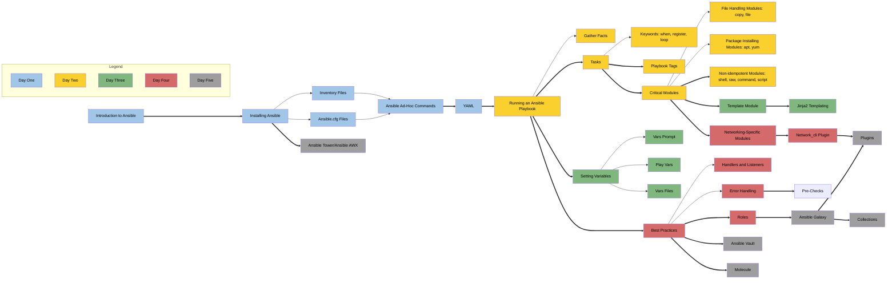

```mermaid
flowchart LR
    A["<span style='color:black;'>Introduction to Ansible</span>"] ==> B["<span style='color:black;'>Installing Ansible</span>"]
    B --> C["<span style='color:black;'>Inventory Files</span>"]
    B --> D["<span style='color:black;'>Ansible.cfg Files</span>"]
    C --> E["<span style='color:black;'>Ansible Ad-Hoc Commands</span>"]
    D --> E
    F["<span style='color:black;'>Running an Ansible Playbook</span>"] --> G["<span style='color:black;'>Gather Facts</span>"]
    I["<span style='color:black;'>Tasks</span>"] --> K["<span style='color:black;'>Keywords: when, register, loop</span>"]
    L["<span style='color:black;'>Critical Modules</span>"] --> O["<span style='color:black;'>File Handling Modules: copy, file</span>"]
    L --> P["<span style='color:black;'>Package Installing Modules: apt, yum</span>"]
    T["<span style='color:black;'>Setting Variables</span>"] --> U["<span style='color:black;'>Vars Prompt</span>"]
    T --> V["<span style='color:black;'>Play Vars</span>"]
    T --> W["<span style='color:black;'>Vars Files</span>"]
    X["<span style='color:black;'>Best Practices</span>"] --> Y["<span style='color:black;'>Handlers and Listeners</span>"]
    X --> Z["<span style='color:black;'>Error Handling</span>"]
    I ==> N["<span style='color:black;'>Playbook Tags</span>"]
    L ==> M["<span style='color:black;'>Non-idempotent Modules: shell, raw, command, script</span>"]
    I ==> L
    L ==> Q["<span style='color:black;'>Template Module</span>"]
    Q ==> S["<span style='color:black;'>Jinja2 Templating</span>"]
    F ==> I
    F ==> T
    F ==> X
    X ==> AA["<span style='color:black;'>Roles</span>"]
    L ==> AI["<span style='color:black;'>Networking-Specific Modules</span>"]
    AI ==> AH["<span style='color:black;'>Network_cli Plugin</span>"]
    X ==> AB["<span style='color:black;'>Ansible Vault</span>"]
    X ==> AC["<span style='color:black;'>Molecule</span>"]
    B ==> AJ["<span style='color:black;'>Ansible Tower/Ansible AWX</span>"]
    E ==> H["<span style='color:black;'>YAML</span>"]
    H ==> F
    Z ==> 325053["<span style='color:black;'>Pre-Checks</span>"]
    AG["<span style='color:black;'>Ansible Galaxy</span>"] ==> AE["<span style='color:black;'>Plugins</span>"]
    AG ==> AF["<span style='color:black;'>Collections</span>"]
    AA ==> AG
    AH ==> AE

    style A fill:#A1C6E7
    style B fill:#A1C6E7
    style C fill:#A1C6E7
    style D fill:#A1C6E7
    style E fill:#A1C6E7
    style F fill:#FAD02E
    style G fill:#FAD02E
    style H fill:#A1C6E7
    style I fill:#FAD02E
    style K fill:#FAD02E
    style L fill:#FAD02E
    style M fill:#FAD02E
    style N fill:#FAD02E
    style O fill:#FAD02E
    style P fill:#FAD02E
    style Q fill:#7FB77E
    style S fill:#7FB77E
    style T fill:#7FB77E
    style U fill:#7FB77E
    style V fill:#7FB77E
    style W fill:#7FB77E
    style X fill:#D46A6A
    style Y fill:#D46A6A
    style Z fill:#D46A6A
    style AA fill:#D46A6A
    style AB fill:#9E9E9E
    style AC fill:#9E9E9E
    style AE fill:#9E9E9E
    style AF fill:#9E9E9E
    style AG fill:#9E9E9E
    style AH fill:#D46A6A
    style AI fill:#D46A6A
    style AJ fill:#9E9E9E

    subgraph Legend
        L1["<span style='color:black;'>Day One</span>"]
        L2["<span style='color:black;'>Day Two</span>"]
        L3["<span style='color:black;'>Day Three</span>"]
        L4["<span style='color:black;'>Day Four</span>"]
        L5["<span style='color:black;'>Day Five</span>"]
    end

    style L1 fill:#A1C6E7
    style L2 fill:#FAD02E
    style L3 fill:#7FB77E
    style L4 fill:#D46A6A
    style L5 fill:#9E9E9E
```
