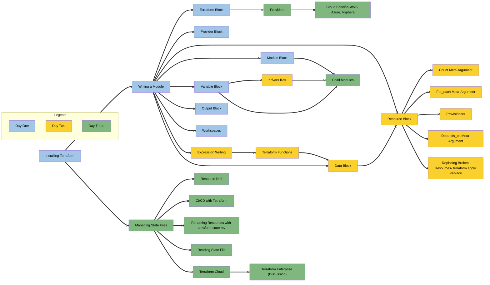

[Mermaid Flow Diagram Link](https://www.mermaidflow.app/flowchart#N4IgZgNg9g7iBcoB2UAmBTAzgg2qGAlqgC4AWCAjABwDMANCKegQOanEJUAMDRCIASSSZiAQwgQCSFgH0AKugBOi0WCiKAtiAYAHKJgLECUJAlAAPBDRoA2BgE9ONAKwA6ax88eALAF8GqKJiZiAAxhCimJhYuAC6DCL2EDHwOOAEEvAAxACCFADCNgCiAOwg8SARAEboEPwAPJg6okgABInJALwAOmFQ0IrwVRGhANYA3L0AfEIi4pLSrQrKquoa9QD0TS1T2iCoBIrooUYm-HIAQnsqSKOYACIqMKaI-iDNR0jEAEotowg8fZPADKxCS6AQYHE0TeYJ0EPgICOJxaLGSADk0BDdPpDMYkDkqph+gBXYgIixWWwOJxuLz0mh+fz4IhkSg2EoMJisdicQF8REAdUUeOkMgAsmgSck9noDKcXpT4DYAEwlVzeGnwCgqqjq5xcQ1G41cFVvQLBRBhCJRFI4CodO3pTK5ArFMoVaq1BrbNqOnp9AZDEYTabC0UsVqiVqS1DS9CbX27AKHY4K85XBg3O6PUTPMxvD7oL6-W4AgIgsEy+BQiAwhhwhFItOojFY2W4hWE4kQMkUkCWZVqjVanV61wGk0ms3MkCEEjkbXOOyMZhsDjwbi8VDnJQqNSaGQXaBjDvy-EhQdUACcnJAjk317NASCohC4Ui0WwqQdVadYAyCBsjyQpSnKBgvTqRFGmaP0-wDUJ+nUYNRDGSYQCmZZ9zWVpjygMZE1g5N9lTE4L0RS5rj+B4nkVQtRE+H4-nLIE81BcFIWhdBYXseF+GRMRpDbDAzzxExu1JclL04W8tRvGc6BZBdKG8FduXXPlt34AAFRQoAANyIJQjxPf4cXPM4rSvWT70oZwqBsCdzVfd8bS-OIEj-b80gAl0QPdcDKlEGooJAGCWnaeDekQoNhlQ0MMN0gyjMUXDTMInY9gOATyJASis2o3N81eXQGOLJiy3gQFUErDiay4ni+MRATW3QTERPMsSCSJST+2su8HwoezHOcXxZ3nNklxVLk115Td+R3RFviwKASUUUJ0BM-CzPeTtyKVCgShKTVbO1bxr0chkvFGl9LVAD9bW839wW850gKyAAxHJ7lNIpAsgn1YMi8EEKQwY4rQ6ZluJNaNrS7aMqQYjsrTXL8qRQraILUrGNLf4qorNi-04utuIbXimxaoS2vbTqux63spKsygjpOwbzsuq6PFG8bWUXChvBO9S5q3EABRAWN4y2086f2gdKBVLgKAnUdqGvJzbrfK0Hvcn9PJe3A3uAt0wM9YLvWg31ga6aKwZQyGMMl5J4YIrYiKy0j0wozMMduGi8zonHyrxliaqJura3rEBG34ltqfa7Fdos7qez7aTtUV5XnFVm8nN55Szuz1ceQ3UXxYANQYghguSaWdrlLr05vAbKFNPxNdcz87We5JXt897-NNiDzdC8K4JB23YpDdCpkrkUa-QF3RkR5HPbRn3s394rgHo3HmIJ1iYHY6tI7J6OKdjlF49ppOuokxm+pklvtTbsbFLnPmVKF2bS4W-gAHkyQ6DJHXUSXslTNy1CUGwXBnJ3WtF3J6+te6G37sbUCHph4hUBhFf0k9kIQwSlMQBxBgHECXivD2OVLJ5Q3pjAO2N3hlRLPvaqtUT4NXJk1ZsV80Q0w6rfemqcmYQJsg+aBsD86TUVt-EumkxaLRAPkVaXwJToDEDIHIigWAkg0OVMBctByK2cNNU6FBVRUHcFzawN19guW1m5buyD-yAWyF9H6Ko-pm2wZbIGeDAwEOntMZRJIvgxnUaIAAtFonReiviUJTNQl4tCqJ+yKoHJhe9KpsPDhw0mjVKZxz4QnAx4kGZp2ZvAYxpjBoWKsdYnm78JqLhVCqIuwtf5aURB9dQMh0CoVIGojRMTdH6NlpZJU1TRwSPqVzWxFotb3UcUgkAjo+6uM+t9X6-0R44PHjbAJ4MgkYR6YoPpAzwliGido0Z8S3aZUSajGh6NN7pMYUWFh2TCZH2JvVfJXDCm8OEonBuQjerpymWYmZ1ibFvyUpNAWsiNLzS6SAJKhkDAmCUNgcZip5ZVK4CY0cKoaAqlmVdeZ9ilmII8qsryqCNnuO2d4i2YUrb+JioE+KM90UEExUgbFCSSJJIzKknMWMSqZODqw75x8ESnwKZfQSxSb6gvxPfCpkzCU1IVqS8lDJGnwpac4CgM05EooUfwe46B4RIFQJgGQJghmiE0TcuJHBcUQu1aOWw3h9X0kpfAnWTi6UG1SEbTZHivFYNZWPa26BQZT25dMa1tr7WOraOKCJ1zYnlSFSjMizy6FpIlTvIOnz8Y5J+RHTh59uFUxVQItVZThGPwJUSsxvr-XXThR-AuiKzXIrLoowU6g7jNA2jiwRhin6jm8M4GgGs7FBuWbStZDK-Im0wUFHxbK-FRUOfbIho7FDjtQlgfNa8i1iq3hkj5FVK2yt+QqgFSrWolNxRqkR+LIFmPnYuw1faEUlCoIOkWf9ERFHMDoI4UR8QyHDEYaQpS8X9R9SqLOcDFkIMemu+l4a0GRuZTG0e7KD2cqOcmjCUGYNYH5a0RDUgWCXpFd7G9bzJX3pDgfMO1a8lRxjs1IpwKUNfrbb+wapLMNSMXN4Ggpri5DogyAZaOgRhMaPHpUYxYZDQ1WutGInrKmQvZhdbtnhA3YeDSs9dBHGVbM8Ts3dcaOV20ITPVT6nFgXC08WVoenYZYEia0ckKwDwaCjDoNT9hWiRKOGp89LGnnJJefQ7eu9pVfMPnKkmAmL5CaBfwkFe0W3guM96v9ZmYUuF7c0ygVB2k-3keLLCqxDwfVCYW4QKH046iVirTtGGl0LM7rhvWoaUF2ZdEyxzLLSP7onoe9z0xWvhdaB1pAXXMBJa66KgqJaGGceYQ+0O7D5W1sEzw5VInP3lO-YOPrWd0PSaaZ-M6SLwOouIGAfSDEHW+UM9OiZ+LHsDcGoS-UWHRu63tM49Z02HPRp3bGsji2KNHpngAKlcN937ihMCtAB9t+5SMqHJb277cVh2y1Sorad3J53-l1sBddorom7tttB0XcHzhIcya-mBzplrET3FfKAozB0DQrnZorCcU5pxQ4cTS8btmfL2ajU5lHC2Dno+WxhUXYgKEk9XqxlJ+2qfpfLSdnjZ3ctn0uw2m7QOU5lcl1waXKlZeTnl4aBSRqVKNfNcO-g+RSAZFQBKKUKCJcg6l6OLg15YEdyV2N2HE2XEuhKB9C4R0kcA18bg8jbnjlTFD+HmMUeL3G7J7ttj5vb3vOO9xqtOW-l5frcJtnt3W29bj2YhPkjXv9sFoL5rijeUYHxz1ypXO5JPkV9S1PPcM-vSzznkoefdkF-2Qm-BlGHZTAn4K6vjza9m8pw3o7WTH3ZefRd-LV332qpKy7h+vXM5g5kn7oD-Nrz0EU59sLhLC0KICwBpqCEEJtB9BkIDs2qhggDAmzFYNQAvjhjDsvvDqvtnrnprvNoXmjsXlRlMOKCAWAYsBAeSOtjAcTkmDXl7Ofq8qWhlnTjbgznboqgVqzh+s7mJunIgVqPJlQLVm9gOgAULuLAFgZjII8AQGAB6s7k3GIq3EnsulZquirvhmrpntgRvrgXsvGomlygfpIXDDIXITtvQalgdpbrTtbi3nfkzg7p3twXAbwZUhJsocIf2teB9uIYovkAIPkPcDIIQGQPIHuG1loDHmhqdBzKgdZnhmGloVgevpvs5qjjroQQfgERsEEa0KEaQEsBEeFhYevOxkwVbs3k+jWo4Q-o7l3jwRzooc-HEfzvADQAnqPhauLPkNACSBHsCPCKELIQQKEJooKMCJogAF5rSbTlxNBMBHDT5u4e6PjPiqHQ4hqq4Rpr44Fzb6GuZJrZF9GoCtCDHHAjGhDBY5ATF0CtA5AzFHB3HzE6CLEJgn7Crk514X4cY05cYyq341Ht4s5P5Nov5uErFz7f51btE2BqRNbdGKLLRICiAaAaYmFYAhGGCDKhbYSHhzDkgyAaD6TLE-pKFDhCHJ6L7oFw4bopF7EkYHFF5HFELImolMb+YrSBYE4FEhbFE4QEmLzEmlHXr16-HMF2HVH8b251HOHP7JwQlknPwWJeHAb-4dJj78DLSiAHBigUFQEwGkkxEPgkrrEjYp40np6YHZC7G6H7Hb4GF74Y5Qz9K6mRj6lUHJAikpbFoW53pN4Am8at4vrM5vrXxgkKlNHuHkmmmqn8zODXhdHB4UT8mHi9GrQ7jRGzqnS+rxHqFp7bGEa2lpFa74GZEskzyrY4Tpn9HekU6MHU4SlVGAnSkcGP7hnFaRk97RnPy5ltG6gKYamIm7hhZrAyBFBfBKAwZ8qbT3B8qhAkhwZnBZnajmLc5WDcB5nK4FmaE7E6Ell4E76GH75EJVmaCtATmhbTnRCtAAAUc5mAC5S5SAAAlHWd8Q2TYf8VlkGQ4cCWGY2p2XfFGQdGuQIZuW0YyL4QgN4IaKigADLoAsDFiZkKHlaAgPgXTqjVbtwbFWj54gCIXIV2p0FlEMAoAYCvTwUUB7DwUqi0U0CBSfkZLZiUCVGBm27wDECKAkgyncKYAkhVAsAqCvF7COghAwlQVdGwUqGuEgX4qKwYUIBYXmY+BxkC5iGamIjUWyjHYlLaVIUoVGnKGjgwJblL60lTYDxbp6EOmHFGFEKi4xb-wCrvkMFpb+nX5sUtmM7-mcGglAVgpv6VIdFKWrnDjVaAYwmiFDnJmEX0VW76WEWGUkUrkUBwWnQqhmVUloFbG7mEYzYHlMkEEVkpqiAxZyAwBQBuVWF+mN5eXahSm+V8Ugkdns7dlKihXEoRUwpRUiEj6aXDnaWMWJXtgGXEWoVwG9YZUPjZV4XUl5VJF7mpG2V7plm75LYl5OVLCkBHDvG0Gn6WG+mX5-EBmVQKa-lAktUAVO5yUdX4pdX949UNJjQVDoCoDIXeSgCXZPnEBQBREgAaAMTaaKAQGKAbggBQC2p7BA2npKATmKKhB6RRB7BSChaoQKiChvaKzOIhAiC+ZY0FzrHizvXIWRK6hUB6hUDeDcA0BUA0UJD6YbT8CzBiASAaZnkA1iDaLqL8CMZihOyJzc3IXEAAASLQqA1YIADNqyTN6A4tdqUtMt5poABFewyQ0gCKvaP1i5f1ANsNINYNENUNxYMNwN8NJFiISN+gU6aNSgGN+IhN0igI4lVo+NUA2mTtLSbwJNH16AkS1gqk8614BoJQ8mYlctfNIoSGsggtewwtvNKZo5h4eEMs0cDEItCtktTYMtMMBmWdStWUVKyOoU6txYLAWts4OtIg-1ZtcNoN3Nxt0NDABtFtiNyNttk5KgXWXtCAON6eeN3FHt6AvdVSPtiipN-tHRfWeoJQXAJQQ0EdgWUdEYkecYMoDYGdidaKekhkk+4u6dPNYtEthdjNgWBdOdRd8CatEE5dld781detddhtjd-AJtpgLd5tigCN-A1tKNvAXdDtJgo9-drtoA7tnt2N49-Ak9kS3gJKzg3gFA8mGGIGS9BmK9Mda98Y8dW9ENGJB9Cdx9itl9Z9+dJ9pD81Jd-AZdmt-M2tD+v1tdn99dRtb9zdgNX9P9VtHdqNgDPd2NLtvy4DQ9kDRN0DiIsDN4Id9NOoWVcm6DzNQo0dGmcdm9R9-AgthDeDF9-AudctujiIytxdN9lQd99DVdjDutzDnDrDr9iI79z9bdv9vDAD6NAjRNQjdUIjBNUDqKsDR0bc9kT4NN3gijTY-NsdleuDGjiIc81cwwm0qdO0RDhj0t4TaTxj19W+IAtDFdFjD9VjNd+tX9bDDjHDrd39ltYQrjYs-DmNgjuNbtojI9fjQBsD14VAKof+iDC9iK4TmDqj0T6jItACQCICyTMTmdFDejGTMzRjV92GpjGt+TlADD3CTDJTdjDETdptLDIN3DNTNtfD7jDTnjTTPjw9IDEjIAAT9kgsJKHRKo8DAzS0XJUhkzIz29ISqiWawybqYyh90zJDszZDG0mTizIQyz5jazljGz1jWzL9Oz7DeztjBz1Tf9ndpzjtjTA9zTvj4j-jftAdNA14AstNpoaDYLTYBDnzQL29py5yoQgyfzLqIy7qUz6iEL1L3LVD0LdDsLhT8LxTTjDdyL5TqLlThzmLJz9tHjztFzdKBL0iNzHTh0jzrSiD86rzKm7zG02jsTO9yU-K2KnLxD2doLst598z6TOV-Lqz2o6zTYmzorZTkNFTXDGLtTdt3dZzCreLlzYjKrRLZNqkGGNgZLT4WV14OrtLpkZrVqNqKFDqTqrLrquaXwZrvLed4LNrWTSzOTeT9931RTT9+zSgbrjj5bVT7dxzbjcrfrLSXj1YgbrThL7TxLtAisislNSsC9OrkT2DG99LENJ6Z6k6WbebczILCzdrhbt9ArjrcLzrCLrr9j7rkrnrtb-9dT2LwDuLYDSrVzbTvtZNIG1N7u50yDisA7KjAtwzI7-ANGsG-KCGd7LAk7M7trVr5DX7+bUL87Zji7FATrv9q71blbHr9d0r3r9TOL5zAbR7Qb3tIb-tt4gspoNgvOOoZQ1LWperST8bXz+DNqXmsgPmw9SAumBHU6qTU7PL9HfLgHKzxboZVt4HaLFb67VbnHNbLjdbu7Db8H-rh7EDbbwbHbZNlN14t4BoHRjII1P7SjIAz7dG8GkTCbSdeJGgMgG2W2n7Frs7Sn8tjHKt1DiIRbBTJbwrZbvHkHm70HXrAnPrQDSAIDzb-YYn1zqHkSqowdNgNAJQBoNNOr8TC8BroziIuOf2MgROBnp9xnvLZn9rrHj9NjlT9nH9vHMHzncH+7CHonLT3nkn-t8DvOLg8Dx01gOrBuLqdLRD+HObhH208XlDTXSXJjzHMLS7QrK7IrEH3HUH6L27WLQn+XInwjSH4nKHJXkSvOlNzzh0NNEbOrWj9XeDIeYeEAEegttHOjjH7XpnnXu6lngr1nfXtnGXg3Dnw3-HO7Ln8rTbirXnJ7E9nbQ0pL1NzgC6qkOrnNEX29R+U+xH2bBjR32TJ3C7DrIHy7YH-Xdn13WXUrTn93eXbnB7k3L37bp7-tilJQPhC6XADkVAOrrN8wHNqZXNG3iIJBKJZBsg+pun1BrXlrh3f7kL+FXXwHoH7H8PV34rG7SPW7d3o3vrwnT3iHWPEnOPAdzzHI9kXA1g6Vq3pB4BYghJ0B0ej7bzTX0hIochLPRnbPhn37yXXP0PPPYQHH-P4NKLQvjnI3srYv43EvhXyrM3MvHIWVMigTNg+jy9NPqvep6vBpWvDXiIARQRWJYRnNhv37xvCXZvkPQHFvsPvPl3pTiPorOXqPe76PBXmPRXr3MDxLF0CecjbS3TXAOrQPe3hrNZAxQxlx4xkxDxsxMgLxbxcf-vv7Jv-7nPyfLHVnbHVvfPmfAvPHyPjv9bzv+fE33jU3xXMvrStNyDOodNzgKvdPavkBTPYf1PurKJaJYoGJDqBRMguJkRMggpRJJJIPB3YP7Pc7g-3XMPvXcPGf2ztvEr9vt3PDuXefdzs9yL7Y83uZNNpDJQazNxE8t7Vemo214gBauAPc1glwT6UMk+rKU7j13O4f90u4-b-oL2z4o9RernIAZLxAHS8wB-tA0L23x5-5AmW-UAjvw17M9iO+HHUswND5C19uT-RLuDwLYv9ueafUfp-yRYEDJ+wvf-rnzG5z9Xehfd3n3VVbEsKAf+BPCHSfBh1N+eHLTlfz04Kg6+kXRAWLnW5H1Qe1rXgRgNLpQ9UupbPAV-12a-9nGUgkgY9z7oedB6Cgsej5xsBIM6BxPQ6FoOM78Bou+OWLqwIQFl5tuQ7QHHR14FoDLWlgmhtYOH5pdEWXHCfkNycFHNpBs-MgW72PagCS+obemorD956gI2PfZTmF0SbIDNu4eaIQYK5YP9zBffDnqrXN42CbOdgsQQ4KIHT9BOuQjHgvyl4e8qBAdVUHPQC4gZE81fbQXlEp4yAG+mneYcnR06XkpyIoaINIXnKLl+U3fadq0Of6YDkhZ3Efi6wG4ZCbuWQmVjP1IFDCW2i-YvpI2JbLgSUhoILlwHgaVCmwtPJgcH136a8YhB-f7ksPv5xDH+hwpjoINT4VBDI6AGAHoG-6dV7IGoT4SUF1B+9gmnRMxJTVcDHQGsIdBeigyyqgYQAUxKALXSqjuALoDWU0NQFaTu55GTIFMKARUAaBWWtXEIGAD0hfASCxAULCECMDEApaIAc0FemSTwVvgpFfSCGkQgaB3UKyBIj+B9qYAaM6gYgNpBaC1B-40NLijxXQAMA0QUAKoOICKB+05A+WUAHGHEB24IIUgdABaO4RkBRiO0SeiQXrqOjnWtTCjPwCyBVAKA-oqoDYFFGGjoAJoiAAnE9GCjZShWbgj6MRBZApwewE0WMGEoqJUAyiAYL6LAA5jcxyY9QJPkzHqBfRSYhgFUALFKA5AYeMYAKhRqIgewfAXgA8EiBMBFoCqXwEAA)
